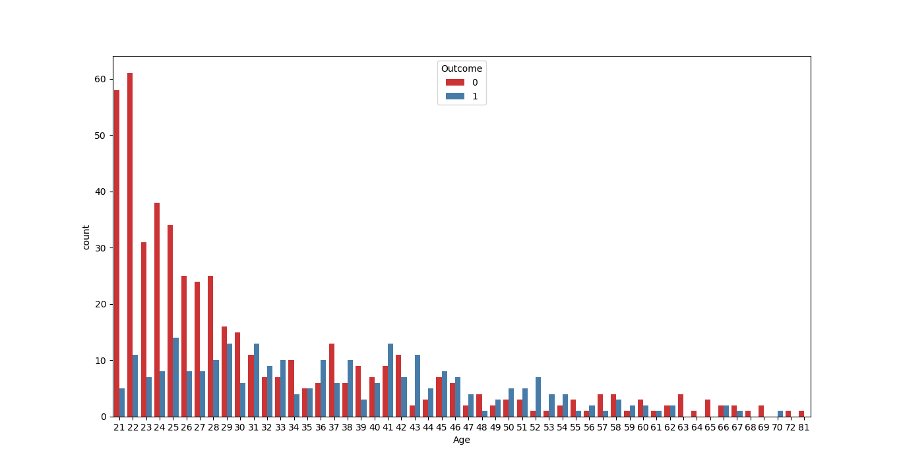
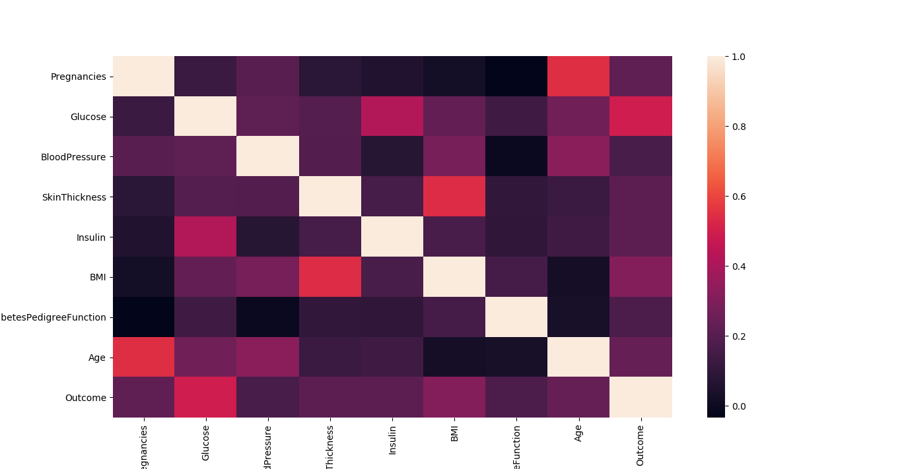

# Diabetes Prediction with K-Nearest Neighbors Algorithm

This project uses the K-Nearest Neighbors (KNN) machine learning algorithm to predict whether a person has diabetes based on various health metrics. The model is trained on the Pima Indian Diabetes Dataset and achieves strong predictive performance.

## Project Overview

Diabetes is a chronic disease that affects millions of people worldwide. Early detection is crucial for effective treatment and management. This project demonstrates how machine learning can be used to predict diabetes risk using various health indicators.

## Dataset Features

The model uses the following features to make predictions:
- **Pregnancies**: Number of times pregnant
- **Glucose**: Plasma glucose concentration after 2 hours in an oral glucose tolerance test
- **BloodPressure**: Diastolic blood pressure (mm Hg)
- **SkinThickness**: Triceps skin fold thickness (mm)
- **Insulin**: 2-Hour serum insulin (mu U/ml)
- **BMI**: Body mass index (weight in kg/(height in m)^2)
- **DiabetesPedigreeFunction**: Diabetes pedigree function (genetic factor)
- **Age**: Age in years
- **Outcome**: Class variable (0 or 1), where 1 indicates diabetes

## Data Preprocessing

- **Missing Value Handling**: Zero values in critical features (Glucose, BloodPressure, SkinThickness, BMI, Insulin) are replaced with the mean of the respective columns
- **Feature Scaling**: StandardScaler is used to normalize the features for optimal KNN performance
- **Train-Test Split**: 80% training, 20% testing

## Model Performance

### Key Metrics:
- **Accuracy Score**: 0.8182 (81.82%)
- **F1 Score**: 0.6957 (69.57%)

### Model Configuration:
- **Algorithm**: K-Nearest Neighbors
- **Number of Neighbors (k)**: 11
- **Distance Metric**: Euclidean
- **Distance Parameter (p)**: 2

## Data Visualization

The project includes comprehensive data visualization:
- Correlation heatmap showing relationships between features
- Age distribution analysis by diabetes outcome
- Data exploration before and after preprocessing




## Installation

1. Clone this repository:
```bash
git clone <repository-url>
cd diabetes_prediction_with_knn
```

2. Install required dependencies:
```bash
pip install -r requirements.txt
```

## Usage

### Running the Jupyter Notebook
```bash
jupyter notebook diabetes_prediction_with_knn.ipynb
```

### Running the Python Script
```bash
python main.py
```

## Project Structure

```
diabetes_prediction_with_knn/
├── README.md
├── requirements.txt
├── pyproject.toml
├── main.py
├── diabetes_prediction_with_knn.ipynb
├── diabetes.csv (dataset)
└── images/
    ├── 1.png
    └── 2.png
```

## Methodology

1. **Data Loading**: Load the Pima Indian Diabetes Dataset
2. **Exploratory Data Analysis**: Analyze data distribution and correlations
3. **Data Preprocessing**: Handle missing values and scale features
4. **Model Training**: Train KNN classifier with optimized parameters
5. **Model Evaluation**: Assess performance using accuracy and F1 score
6. **Visualization**: Create plots to understand data patterns

## Key Insights

- The model achieves 81.82% accuracy, demonstrating good predictive capability
- Features like Glucose, BMI, and Age show strong correlations with diabetes outcome
- Proper handling of zero values in medical data significantly improves model performance
- KNN with k=11 provides optimal balance between bias and variance

## Technologies Used

- **Python 3.12+**
- **scikit-learn**: Machine learning algorithms
- **pandas**: Data manipulation and analysis
- **numpy**: Numerical computations
- **matplotlib**: Data visualization
- **seaborn**: Statistical data visualization
- **jupyter**: Interactive development environment

## Future Improvements

- Implement cross-validation for more robust model evaluation
- Experiment with other algorithms (Random Forest, SVM, Neural Networks)
- Feature selection and engineering techniques
- Hyperparameter tuning using GridSearchCV
- Deploy model as a web application

## Contributing

Contributions are welcome! Please feel free to submit a Pull Request.

## License

This project is open source and available under the [MIT License](LICENSE).

